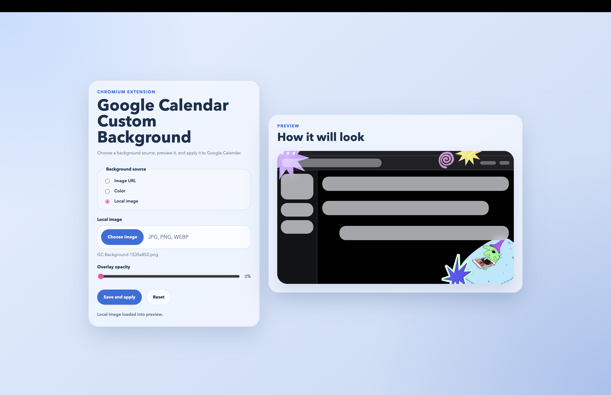
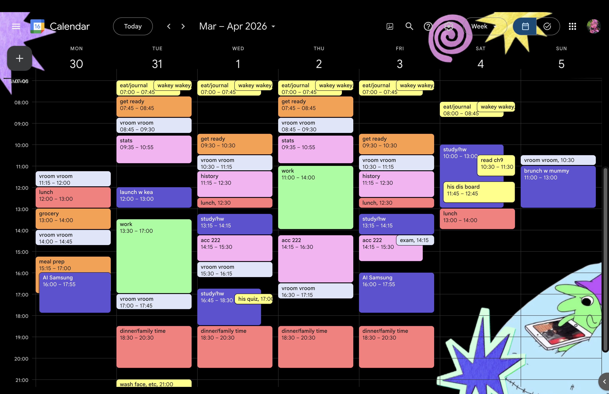

# 📅 Google Calendar Custom Background

Chromium extension that breathes life into your Google Calendar. Add personal images, solid colors, and enjoy a cleaner, transparent UI.

 

---

 

## ✨ Key Features

* **Custom Backgrounds:** Support for Image URLs, Local Uploads, or Solid Colors.
* **Live Preview:** See changes in real-time within the settings page.
* **Seamless UI:** Injected "Quick Settings" button directly in the Calendar header.
* **Smart Styling:** Auto-adapts to Light/Dark themes and adds transparency to sidebars.
* **Zero Latency:** Lightweight, no-build vanilla JS implementation.

 

## 🛠 Project Structure

| File | Responsibility |
| --- | --- |
| `manifest.json` | Extension metadata & Manifest V3 configuration. |
| `content.js/css` | Injects background, handles theme detection & UI transparency. |
| `options.js/html` | The settings dashboard with live preview & storage logic. |
| `background.js` | Service worker managing settings page communication. |

 

---

 

## 🚀 Quick Start

1. **Clone** this repository or download the ZIP.
2. Open **`chrome://extensions`** in your browser.
3. Enable **Developer mode** (toggle in the top right).
4. Click **Load unpacked** and select the project folder.
5. Open [Google Calendar](https://calendar.google.com) and click the new background icon in the top bar!

 

---

 

## ⚙️ Technical Details

<b>How it works (Click to expand)</b>

The extension uses `chrome.storage.local` to sync settings.

* **Rendering:** Backgrounds are forced to `background-size: cover` and `center center` for consistent UI.
* **Theming:** Injects CSS variables to soften Google's native sidebar and task panels.
* **Communication:** A background worker ensures the settings page opens safely from the injected header button.

<b>Current Limitations</b>

* **DOM Sensitivity:** Since Google Calendar is a 3rd-party app, UI updates by Google may require CSS selector fixes.
* **Storage:** Large local images might hit storage limits; URLs are recommended for high-res photos.

---

 

## 📸 Screenshots

| Options Page | Calendar View |
| --- | --- |
|  | 

 |

 

---

 

### 🔮 Future Ideas

* [ ] Blur & Brightness filters.
* [ ] Curated background presets.
* [ ] Multiple transparency profiles for the sidebar.